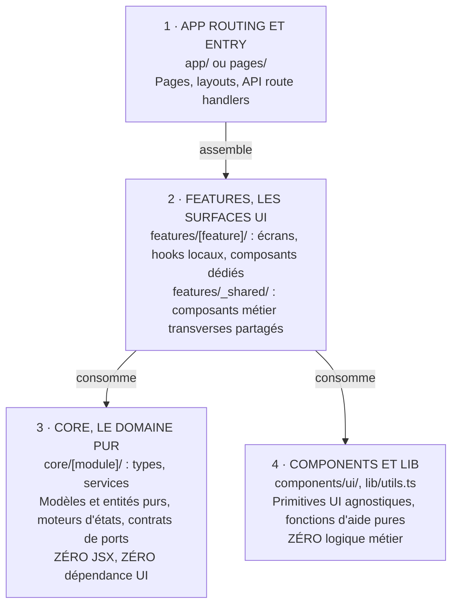

# Maedow Arch (Maedow Arch Blueprint)

> **Standard d'Architecture Logicielle Modulaire, Découplée & Agnostique pour Applications Web Modernes (TypeScript / React / Next.js / etc.)**  
> **Maedow Arch** (*maedow-arch*) définit un pattern de conception robuste, agnostique de vos choix de base de données, d'authentification ou d'outils tiers, conçu pour garantir une maintenabilité, une évolutivité et une testabilité optimales.

---

## Vision et Piliers Fondamentaux de Maedow Arch

**Maedow Arch** repose sur 6 principes cardinaux :

1. **Séparation Stricte du Domaine Métier et de l'UI (Zéro Modèle dans le JSX)** : Les règles métier, les interfaces de données, les schémas de validation et les transitions d'état sont 100 % isolés du code de présentation React/HTML.
2. **Architecture en Couches à Dépendance Unidirectionnelle** : Le flux de dépendance est strict (`app -> features -> core -> lib`). Le domaine métier (`core`) n'a aucune connaissance des composants d'interface (`features` / `components`).
3. **Agnosticisme de l'Infrastructure (Pattern Ports & Adapters / Hexagonal)** : La base de données, l'authentification et les API tierces sont masquées derrière des contrats d'interfaces. Changer de base (Postgres, SQLite, MongoDB, IndexedDB, Prisma, Drizzle) ou d'auth (BetterAuth, Auth.js, Supabase, Firebase, JWT custom) ne touche jamais le cœur métier ni l'UI.
4. **Erreurs Typées & Prévisibles (Result Pattern)** : Les refus attendus et les échecs fonctionnels sont retournés comme des données discriminées (`{ ok: false, error: "..." }`) et non levés comme des exceptions silencieuses.
5. **Garde-fous Outillés (Machine-Enforced Architecture)** : Les frontières architecturales ne reposent pas sur la simple discipline humaine mais sont vérifiées par le compilateur TypeScript (`strict`) et des règles de linter (`eslint-plugin-boundaries`).
6. **Pragmatisme & Composition Évolutive** : L'architecture évite l'over-engineering grâce à l'inférence de types, des générateurs de code et un pattern de composants partagés (`features/_shared/`).

---

## Vue d'Ensemble des Couches Maedow Arch



---

## Matrice des Rôles par Couche

| Couche | Répertoire | Responsabilité | Ce qu'elle CONTIENT | Ce qu'elle NE CONTIENT JAMAIS |
| :--- | :--- | :--- | :--- | :--- |
| **App** | `app/` | Point d'entrée, routing, injection de dépendances. | Les fichiers d'amorçage et de routing du framework hôte. Sous Next.js : `page.tsx`, `layout.tsx`, `route.ts`, middlewares. Voir [Maedow Arch hors Next.js](#maedow-arch-hors-nextjs). | Logique métier détaillée, requêtes directes non encapsulées. |
| **Features** | `features/<feature>/` | Écrans et modules fonctionnels utilisateur. | Composants `.tsx`, hooks React dédiés, adaptateurs de vue. | Définitions de modèles de données partagés, logique de persistance brute. |
| **Shared Features** | `features/_shared/` | Composants UI métier utilisés par au moins deux features. | Composants composites métier partagés (`UserAvatarCard`, `AddressPicker`). | Primitives UI agnostiques (qui vont dans `components/ui/`). |
| **Core** | `core/<module>/` | Cœur métier, domaine pur, persistance, contrats. | Types/Interfaces purs (`.ts`), machines d'états, validateurs, interfaces de repositories. | **ZÉRO fichier `.tsx`**, aucun import React/DOM. |
| **UI Primitives** | `components/ui/` | Composants atomiques réutilisables (Design System). | Boutons, Modales, Inputs, Dropdowns, etc. | Types métier, appels API, état applicatif global. |
| **Lib** | `lib/` | Utilitaires transverses non liés au métier. | Formatage, manipulation de chaînes/dates, helpers CSS (`cn`). | Types spécifiques au métier, règles de gestion. |

---

<ModeFull>

## Agnosticisme Technique : Adapters & Infrastructure dans Maedow Arch

> **Règle de Lazy Abstraction (Introduction Différée des Contrats)** : un `contract.ts` + un système d'adapters ne doit être introduit **qu'au moment où une deuxième implémentation réelle est nécessaire** (migration de base, multi-tenant avec fournisseurs différents, besoin de mock avancé en test). Tant qu'un seul fournisseur (une seule DB, un seul provider d'auth) est utilisé et qu'aucun changement n'est prévu à court terme, l'accès direct dans `core/<domaine>/repository.ts` est conforme à Maedow Arch. Abstraire par anticipation sans second cas d'usage concret est un anti-pattern Maedow Arch : ça ajoute de l'indirection sans bénéfice mesurable.

### La Lazy Abstraction ne dispense pas de la testabilité

La règle ci-dessus autorise l'accès direct au client de base de données tant qu'il n'y a qu'un fournisseur. Prise à la lettre, elle produit ceci :

```typescript
// ❌ core/orders/service.ts
import { db } from "@/core/server/db";

export async function annulerCommande(id: string) {
  const commande = await db.order.findUnique({ where: { id } });
  // ...
}
```

Ce code est conforme à la Lazy Abstraction, et il **casse la promesse centrale du standard** : `core/` ne se teste plus sans simuler `db`. Deux exigences du corpus se contredisent, et le développeur pressé tranchera en faveur de celle qu'il vient de lire.

**Le service reçoit son dépôt en paramètre, décrit par un type structurel écrit sur place :**

```typescript
// ✅ core/orders/service.ts
import type { Result } from "@/core/common/result";
import type { Commande } from "./types";

type DepotCommandes = {
  trouverParId(id: string): Promise<Commande | null>;
  changerStatut(id: string, statut: Commande["statut"]): Promise<Commande>;
};

export async function annulerCommande(
  depot: DepotCommandes,
  id: string
): Promise<Result<Commande, { kind: "introuvable" } | { kind: "deja-annulee" }>> {
  const commande = await depot.trouverParId(id);
  if (commande === null) return { ok: false, error: { kind: "introuvable" } };
  if (commande.statut === "annulee") return { ok: false, error: { kind: "deja-annulee" } };

  return { ok: true, data: await depot.changerStatut(id, "annulee") };
}
```

**Ce n'est pas un `contract.ts` déguisé**, et la distinction est le cœur du sujet. La Lazy Abstraction interdit d'ouvrir un fichier de contrat et un jeu d'adaptateurs pour un fournisseur unique : de l'indirection, des fichiers, une inversion de dépendance à maintenir. Un type écrit à côté de la fonction qui l'emploie n'est rien de tout cela. Il ne décrit pas le dépôt, il décrit **ce dont cette fonction a besoin**, ce qui est en général trois méthodes sur les quarante que le client expose.

Ce que ça change, concrètement :

| | Import direct | Type structurel en paramètre |
| :--- | :--- | :--- |
| Test du service | simuler le client entier | un objet littéral de trois méthodes |
| Fichiers créés | aucun | aucun |
| Changement de fournisseur | réécrire le service | réécrire le seul appelant |
| Conforme à Lazy Abstraction | oui | oui |

Le `repository.ts` reste l'implémentation concrète, celle qui parle au client réel et qui convertit ses exceptions avec `fromThrowable`. C'est `app/` qui les assemble, et c'est précisément son rôle : les points d'entrée injectent les dépendances.

**Quand introduire un vrai `contract.ts` malgré tout ?** À la deuxième implémentation réelle, comme la règle le dit. Le type structurel n'anticipe rien : il existe parce que la fonction a besoin d'un paramètre, pas parce qu'un second fournisseur pourrait apparaître un jour.

### Gestion de l'Authentification (Auth Agnostic)

Le code applicatif interagit avec une abstraction d'identité :

```typescript
// core/auth/types.ts
export interface UserSession {
  userId: string;
  email?: string;
  role: "admin" | "member" | "guest";
}

export interface AuthService {
  getSession(req: Request): Promise<UserSession | null>;
  requireUser(req: Request): Promise<UserSession>;
}
```

* **Implémentations interchangeables** :
  * `core/auth/better-auth.adapter.ts` (BetterAuth)
  * `core/auth/supabase.adapter.ts` (Supabase)
  * `core/auth/authjs.adapter.ts` (NextAuth / Auth.js)
  * `core/auth/jwt.adapter.ts` (API backend externe / JWT custom)

### Gestion de la Persistance (Database Agnostic)

Le domaine définit ses interfaces de Repository (Ports) :

```typescript
// core/users/repository.contract.ts
import type { UserEntity, CreateUserInput } from "./types";

export interface UserRepository {
  findById(id: string): Promise<UserEntity | null>;
  create(input: CreateUserInput): Promise<UserEntity>;
  update(id: string, partial: Partial<UserEntity>): Promise<UserEntity>;
}
```

* **Implémentations concrètes (Adapters)** :
  * `core/users/postgres.repository.ts` (SQL brut / `pg`)
  * `core/users/prisma.repository.ts` (Prisma ORM)
  * `core/users/drizzle.repository.ts` (Drizzle ORM)
  * `core/users/dexie.repository.ts` (IndexedDB / Local-first)
  * `core/users/firestore.repository.ts` (Firebase / Firestore)

---

</ModeFull>

## Composition de Features & Éléments Partagés (`features/_shared/`)

Pour respecter la règle de Maedow Arch « *Une feature n'importe pas une autre feature* », les éléments d'interface composites transverses sont placés dans `features/_shared/` :

```
features/
├── checkout/                 # Feature autonome
│   └── CheckoutScreen.tsx    # Consomme _shared/AddressPicker
├── account/                  # Feature autonome
│   └── ProfileScreen.tsx     # Consomme _shared/AddressPicker
└── _shared/                  # Composants métier partagés
    └── AddressPicker.tsx     # Dépend de core/, mais réutilisable
```

### Règle de Dégradation de `features/_shared/` (Anti Fourre-Tout)

Pour empêcher `features/_shared/` de devenir un dépotoir avec le temps, deux règles s'appliquent :

1. **Extraction a posteriori uniquement** : un composant n'est **jamais créé directement** dans `_shared/`. Il naît dans une feature, et n'est déplacé vers `_shared/` que lorsqu'une **deuxième feature en a réellement besoin**.
2. **Revue périodique d'usage** : à intervalle régulier (ex. tous les X sprints, ou via un script listant les imports réels de chaque fichier de `_shared/`), tout composant qui n'est plus consommé que par une seule feature **redescend** dans cette feature.

---

## Règle de Dépendance et Frontières Maedow Arch (`eslint-plugin-boundaries`)

Ces frontières portent les codes **MA-001**, **MA-002** et **MA-003** du [registre des règles](./rules.md), et ce sont les codes que citent les messages de lint. Le registre dit, pour chacune des neuf règles du standard, si elle est vérifiée par la machine ou tenue par l'équipe : c'est là qu'il faut regarder avant de se demander si une exigence sera attrapée automatiquement.

```javascript
// eslint.config.mjs
import boundaries from "eslint-plugin-boundaries";

export default [
  {
    plugins: { boundaries },
    settings: {
      "boundaries/elements": [
        { type: "app", pattern: "app/**" },
        { type: "feature", pattern: "features/*", capture: ["feature"] },
        { type: "shared-feature", pattern: "features/_shared/**" },
        { type: "core", pattern: "core/**" },
        { type: "components", pattern: "components/**" },
        { type: "lib", pattern: "lib/**" },
      ],
    },
    rules: {
      "boundaries/dependencies": [
        "error",
        {
          default: "disallow",
          policies: [
            { from: { element: { type: "app" } }, allow: { to: { element: { types: { anyOf: ["feature", "shared-feature", "core", "components", "lib"] } } } } },
            { from: { element: { type: "feature" } }, allow: { to: { element: { types: { anyOf: ["shared-feature", "core", "components", "lib"] } } } } },
            { from: { element: { type: "feature" } }, allow: { to: { element: { type: "feature", captured: { feature: "{{from.feature}}" } } } } },
            { from: { element: { type: "shared-feature" } }, allow: { to: { element: { types: { anyOf: ["core", "components", "lib"] } } } } },
            { from: { element: { type: "core" } }, allow: { to: { element: { types: { anyOf: ["core", "lib"] } } } } },
            { from: { element: { type: "components" } }, allow: { to: { element: { types: { anyOf: ["components", "lib"] } } } } },
            { from: { element: { type: "lib" } }, allow: { to: { element: { type: "lib" } } } },
          ],
        },
      ],
    },
  },
];
```

---

## Structure Recommandée d'un Projet sous Maedow Arch

```text
src/
├── app/                        # Routing & Points d'entrée
│   ├── (auth)/
│   ├── (dashboard)/
│   ├── api/
│   ├── layout.tsx
│   └── page.tsx
│
├── core/                       # Domaine & Logique Métier Pure (100% .ts)
│   ├── <domaine>/              # Ex: billing, users, catalog...
│   │   ├── types.ts            # Entités et modèles
│   │   ├── validation.ts       # Schémas Zod
│   │   ├── service.ts          # Cas d'usage
│   │   ├── contract.ts         # Seulement à la 2e implémentation, voir Lazy Abstraction
│   │   └── repository.ts       # Adapter de persistance
│   ├── auth/                   # Abstraction d'authentification
│   └── server/                 # Infra serveur (DB Pool, Env)
│
├── features/                   # Écrans & Surfaces UI
│   ├── _shared/                # Composants composites métier partagés
│   ├── <feature_A>/
│   │   ├── components/         # Composants .tsx dédiés
│   │   ├── hooks/              # Hooks React locaux (.ts)
│   │   ├── Screen.tsx          # Composant principal d'écran (.tsx)
│   │   └── types.ts            # Types d'affichage locaux (.ts)
│   └── <feature_B>/
│
├── components/                 # Primitives UI Agnostiques
│   └── ui/                     # Design System (Button, Modal, Input...)
│
├── lib/                        # Utilitaires Génériques Transverses
│   ├── utils.ts
│   └── dates.ts
│
└── tests/                      # Tests automatisés
    ├── unit/                   # Tests unitaires du core/ (ultra rapides)
    ├── integration/            # Tests adaptateurs & DB
    └── e2e/                    # Tests bout en bout (Playwright)
```

---

### Installer une base de composants sans sortir des couches

`components/ui/` est l'endroit prévu pour une base de composants, shadcn ou une autre. Un point de configuration mérite pourtant d'être corrigé avant la première installation.

L'assistant de shadcn écrit un `components.json` qui déclare, par défaut :

```json
{ "aliases": { "components": "@/components", "hooks": "@/hooks" } }
```

**`@/hooks` n'est aucune des cinq couches.** Tout composant qui embarque un hook, et il y en a, le dépose alors dans `src/hooks/`, où il échappe à deux garde-fous à la fois : l'audit ne l'examine pas, et `eslint-plugin-boundaries` ne lui applique aucune politique, faute de correspondre à un type déclaré. Un hook posé là peut importer n'importe quoi, y compris remonter le flux, sans que rien ne le signale.

Faites pointer l'alias vers un répertoire couvert avant d'installer quoi que ce soit :

```json
{ "aliases": { "components": "@/components/ui", "hooks": "@/lib" } }
```

Un hook réellement transverse appartient à `lib/`. Un hook qui sert un seul écran appartient au `hooks/` de sa feature, et c'est là qu'il faut le déplacer quand la base de composants en dépose un.

`npx maedow-arch check` signale les fichiers rangés sous `src/` hors de toute couche, ce qui rattrape le cas s'il se produit quand même.

## Règle de Logique Extraite : ce que `hooks/` reçoit

L'arborescence ci-dessus place un dossier `hooks/` dans chaque feature. Il reçoit **la logique de vue de l'écran** : son état, ses appels, ses dérivations. Le composant qui l'utilise se réduit alors au rendu.

> **Règle de Logique Extraite** : dès qu'un écran porte plus de trois états ou déclenche un appel réseau, sa logique de vue appartient à un hook de la feature, et le composant se réduit au rendu.

Ce n'est pas une préférence de style. C'est ce qui fait entrer la testabilité dans `features/`.

### Le problème que cela résout

Le standard met la testabilité au premier rang de ses arguments, et la Pyramide de Tests promet des tests de domaine rapides parce que `core/` ne dépend d'aucun DOM. C'est vrai, et c'est insuffisant : **rien n'est dit de ce qui se passe dans les écrans**, où la logique s'accumule sans qu'aucune règle ne s'y oppose.

Un écran de quatre cents lignes portant douze `useState` et ses appels réseau respecte les neuf règles du registre. Le flux ne remonte pas, aucune feature n'en importe une autre, `core/` reste pur : le lint est vert, l'audit est vert. Il n'est simplement pas testable sans monter un arbre React, alors qu'une logique extraite dans un hook `.ts` l'est.

Autrement dit, sans cette section, la testabilité s'arrête à la frontière de `features/` et le corpus ne dit pas comment l'y faire entrer.

### Quand extraire

Extrayez dans un hook dès que l'écran remplit **l'une** de ces deux conditions :

- il porte **plus de trois états**, ou
- il déclenche **un appel réseau**.

Le seuil est indicatif et il est là pour éviter que chaque équipe invente le sien. En dessous, un `useState` dans le composant ne coûte rien et l'extraire ajouterait un fichier sans rien rendre plus clair : la Règle de Lazy Abstraction s'applique ici comme ailleurs.

### La forme

```ts
// features/panier/hooks/usePanier.ts
import { useEffect, useState } from "react";
import type { LigneVM } from "../types";
import { chargerPanier } from "@/core/panier/service";

type EtatPanier =
  | { statut: "chargement" }
  | { statut: "erreur"; message: string }
  | { statut: "pret"; lignes: readonly LigneVM[]; total: number };

export function usePanier(clientId: string): EtatPanier {
  const [etat, setEtat] = useState<EtatPanier>({ statut: "chargement" });

  useEffect(() => {
    let vivant = true;

    void chargerPanier(clientId).then((resultat) => {
      if (!vivant) return;
      setEtat(
        resultat.ok
          ? { statut: "pret", lignes: resultat.value.lignes, total: resultat.value.total }
          : { statut: "erreur", message: resultat.error.message }
      );
    });

    return () => {
      vivant = false;
    };
  }, [clientId]);

  return etat;
}
```

L'écran n'a plus qu'à distinguer les trois cas :

```tsx
// features/panier/Screen.tsx
import { usePanier } from "./hooks/usePanier";

export function PanierScreen({ clientId }: { clientId: string }) {
  const etat = usePanier(clientId);

  if (etat.statut === "chargement") return <p>Chargement…</p>;
  if (etat.statut === "erreur") return <p role="alert">{etat.message}</p>;

  return (
    <ul>
      {etat.lignes.map((ligne) => (
        <li key={ligne.id}>{ligne.libelle}</li>
      ))}
    </ul>
  );
}
```

Trois choses valent d'être remarquées. L'état est **une union discriminée** plutôt que trois booléens indépendants, ce qui rend impossible l'état « en chargement et en erreur ». Le hook rend un état, jamais des setters : l'écran ne peut pas contourner la logique. Et l'effet annule proprement sa mise à jour si le composant disparaît avant la réponse, ce qui est exactement le genre de détail qu'on écrit une fois dans un hook plutôt que douze fois dans des écrans.

### Le cas d'un cache client

Une bibliothèque de cache de données, TanStack Query ou SWR, ne change rien à la règle : `useQuery` et `useMutation` vivent dans le `hooks/` de la feature, et leur `queryFn` appelle une fonction de `core/<domaine>/service.ts`.

```ts
// features/panier/hooks/usePanier.ts
export function usePanier(clientId: string) {
  return useQuery({
    queryKey: ["panier", clientId],
    queryFn: () => chargerPanier(clientId), // vit dans core/panier/service.ts
  });
}
```

Le hook orchestre le cache, il ne porte aucune règle métier. C'est ce qui permet de changer de bibliothèque de cache, ou de s'en passer, sans toucher au domaine. Un `queryFn` qui contiendrait un calcul de remise remonterait la logique dans `features/`, ce que MA-001 interdit et que le linter ne verra pas puisqu'il n'y a pas d'import fautif.

### Ce que cela change pour les tests

`usePanier` se teste avec un moteur de rendu de hooks, sans écran. Ce que le composant garde, le choix entre trois branches, se vérifie d'un coup d'œil.

C'est la seule façon de faire remonter la Pyramide de Tests au-dessus de `core/`. Un projet qui applique cette section voit son nombre de tests croître sans que son domaine change, et ce n'est pas de la couverture pour la métrique : c'est de la logique qui était intestable et qui ne l'est plus.

### Une règle tenue par l'équipe

Aucun code `MA` ne porte cette section, et aucun linter ne la vérifie. Compter les `useState` d'un fichier produirait un seuil facile à contourner et des faux positifs sur les écrans qui ont de bonnes raisons d'être longs.

Elle appartient aux **Règles de conception**, que [le registre](./rules.md) recense à part des neuf codes `MA` : celles-ci demandent un jugement là où un code se constate. Le seuil est indicatif, et un écran à quatre états ne viole rien, il mérite un regard. Le standard préfère le dire plutôt que de laisser croire qu'un outil la vérifie.

---

## Génération Rapide de Code (Scaffolding Anti-Boilerplate)

Pour accélérer le développement sous Maedow Arch :

```bash
# Générer une nouvelle feature avec toute son arborescence
npm run generate:feature orders

# Générer un nouveau domaine core avec contrat et types
npm run generate:domain billing
```

---

## Mode Light vs Mode Full : Quand Appliquer Maedow Arch Intégralement

La Maedow Arch complète (4 couches, contracts, adapters, générateurs) est conçue pour des produits qui grandissent dans le temps (SaaS, applications métier durables). Elle est disproportionnée pour un site vitrine, un prototype ou une landing page. Pour éviter la sur-ingénierie, **Maedow Arch définit deux profils explicites** :

| Critère | **Maedow Arch Light** | **Maedow Arch Full** |
| :--- | :--- | :--- |
| Type de projet | Site vitrine, prototype, MVP jetable, landing page | SaaS, produit avec cycle de vie long, produit multi-clients |
| Durée de vie prévue | Courte (< 6 mois) ou usage unique | Longue, avec évolutions régulières |
| Logique métier | Faible ou inexistante | Significative (règles, calculs, transitions d'état) |
| Structure recommandée | `app/`, `features/`, `components/` et `lib/`, avec la logique directement dans la feature et **sans couche `core/`** | Structure complète : `app/ → features/ → core/ → lib/` |
| Contracts / Adapters | Aucun, accès direct à la donnée | Introduits uniquement via la Règle de Lazy Abstraction, voir [Agnosticisme technique](#agnosticisme-technique--adapters--infrastructure-dans-maedow-arch) |
| Result Pattern | Optionnel | Recommandé, avec helpers, voir « Helpers obligatoires pour le Result Pattern » dans `conventions.md` |

### Ce que Light conserve

Light retire la couche domaine, rien d'autre. `components/ui/` et `lib/` restent légitimes : un site vitrine a des boutons et des helpers de formatage sans que cela constitue de la sur-ingénierie, et les garder à part rend la bascule ultérieure indolore.

Les **règles de frontières s'appliquent identiquement dans les deux profils**, voir [Règle de dépendance et frontières](#règle-de-dépendance-et-frontières-maedow-arch-eslint-plugin-boundaries). Une feature n'importe jamais une autre feature, `components/` demeure présentationnel, `lib/` ne dépend de rien. Ces contraintes ne coûtent rien et valent quelle que soit la taille du projet. Les deux profils ne sont donc pas deux jeux de règles, mais une relation d'inclusion : Light ne peuple pas `core/`, il ne l'autorise pas différemment.

Conséquence pratique : `eslint-config-maedow-arch` sert les deux profils sans configuration distincte.

### Passer de Light à Full

La bascule n'est pas une migration, c'est une addition. Rien de ce qui existe ne bouge : `app/`, `features/`, `components/` et `lib/` gardent leur place et leurs règles, et la couche domaine apparaît à côté.

Elle se produit au moment où un domaine devient nécessaire, et le générateur la porte :

```bash
npm run generate:domain order-item
```

Sur un projet Light, cette commande crée `core/common/result.ts` avant d'écrire le domaine, puis annonce le changement de profil. Il n'y a rien d'autre à faire, et surtout rien à déplacer.

C'est pour cette raison que `core/` reste vide en Light plutôt que d'être livré avec un Result Pattern inutilisé : une couche présente mais vide invite à y écrire du domaine par anticipation, ce que la Règle de Lazy Abstraction interdit. La couche naît de son premier habitant.

**Cette phrase vise le profil Light, et elle ne dit pas que `result.ts` serait une abstraction anticipée.** En mode Full, le générateur le livre avec la couche, et c'est cohérent : la Règle de Lazy Abstraction porte sur les contrats et les adaptateurs, c'est-à-dire sur l'indirection qu'on ajoute pour une deuxième implémentation qui n'existe pas encore. Le Result Pattern n'est pas une indirection, c'est le type de retour que toute la couche emploie dès sa première fonction. Ce qui naît de son premier habitant, c'est la couche `core/`, pas le vocabulaire qu'elle parle.

Le mouvement inverse n'est pas outillé, et c'est délibéré : retirer une couche domaine peuplée demande de décider où va chacune de ses règles, et cette décision n'appartient pas à un générateur.

### Choisir son profil à l'installation

```bash
npx create-maedow-arch-app mon-projet --mode full    # les quatre couches
npx create-maedow-arch-app mon-projet --mode light   # sans couche core
```

Sans drapeau, la CLI pose la question lorsqu'elle est lancée depuis un terminal, et retient `full` sinon.

Chaque profil se décline en deux contenus : `--template demo` livre un compteur borné illustrant le profil choisi, `--template blank` livre l'arborescence seule.

Le style se choisit de la même façon, `--style css` pour du CSS natif sans aucune dépendance, `--style tailwind` pour Tailwind CSS 4 configuré. Le défaut est `css` : le standard revendique l'agnosticisme d'infrastructure, et la démonstration doit prouver qu'aucun framework de style n'est nécessaire pour livrer quelque chose de soigné. Générer la même démonstration dans les deux profils et comparer les arborescences est le moyen le plus court de saisir ce que la séparation apporte, et ce qu'elle coûte.

**Règle de bascule** : un projet démarré en Mode Light qui gagne en complexité (nouvelle feature qui duplique de la logique, besoin de tester le métier indépendamment de l'UI, montée en charge du produit) doit migrer progressivement vers le Mode Full, domaine par domaine, jamais en un seul refactor global.

---

## Maedow Arch hors Next.js

Le standard revendique l'agnosticisme technique. Il doit donc valoir au-delà du framework qui a servi à le formuler.

**Trois couches sur quatre ne bougent pas, à une condition.** `features/`, `core/`, `components/` et `lib/` ne connaissent ni routeur, ni convention de fichiers, ni rendu serveur. Elles sont portables telles quelles **si les écrans reçoivent leurs données au lieu d'aller les chercher**.

Cette condition n'est pas une réserve de style : c'est elle qui fait tout tenir. Un projet dont les écrans appellent eux-mêmes leurs sources verra le coût du portage se répandre dans `features/`, et l'affirmation ci-dessus sera fausse pour lui. Le [chargement de données côté serveur](#le-chargement-de-données-côté-serveur) donne le test à faire sur votre propre code avant de vous lancer.

**Seule la couche `app/` s'adapte.** Sa définition reste inchangée : point d'entrée, routing, injection de dépendances. Ce sont ses fichiers qui diffèrent, parce que chaque framework déclare ses routes à sa façon.

| Responsabilité | Next.js App Router | React sur Vite |
| :--- | :--- | :--- |
| Point d'entrée | `app/layout.tsx` | `app/main.tsx` |
| Coquille et injection | `app/layout.tsx` | `app/App.tsx` |
| Déclaration des routes | l'arborescence de `app/` | `app/routes.tsx` |

L'interdiction, elle, ne change jamais : aucune logique métier détaillée dans cette couche, quel que soit le framework.

### Le chargement de données côté serveur

C'est le point où le portage se joue vraiment, et la question difficile de cette section. Les Server Components et les Server Actions n'ont pas d'équivalent hors Next.js.

**La condition qui fait tenir l'affirmation.** Les trois couches ne bougent pas *à condition que vos écrans reçoivent leurs données au lieu d'aller les chercher*. Ce n'est pas le framework qui rend le portage possible, c'est la règle « zéro modèle dans le JSX » appliquée avant lui.

Le test à faire sur votre propre code, avant de vous lancer :

> Ouvrez trois écrans de `features/`. Reçoivent-ils leurs données en props, ou appellent-ils eux-mêmes une source ?

Si les écrans reçoivent, ce qui suit vous coûtera une couche. **S'ils vont chercher, le portage vous coûtera les quatre**, parce que chaque écran devra être repris, et l'affirmation ci-dessus ne vaut pas pour votre projet.

#### Deux chemins, deux destins

La donnée lue par une route API et la donnée lue dans un Server Component ne se portent pas du tout pareil.

**La route API se porte presque telle quelle.** Le corps de la fonction est identique, seuls son emplacement et sa signature d'export changent :

```typescript
// Next : app/api/catalogue/route.ts
export async function GET() {
  const resultat = verifierCatalogue(SOURCE);
  if (!resultat.ok) return Response.json({ erreur: resultat.error }, { status: 404 });
  return Response.json(resultat.data);
}
```

Le même corps se pose dans un gestionnaire Express, Hono ou Fastify. Rien à repenser.

**Le Server Component, lui, n'a pas d'équivalent.** Il faut le remplacer, et le remplacement change de nature :

| | Server Component | Effet client, hors Next |
| :--- | :--- | :--- |
| Moment de la lecture | pendant le rendu | après le montage |
| États à exprimer | aucun | trois : chargement, erreur, données |
| Route intermédiaire | inutile | obligatoire |
| Annulation | rien à gérer | à gérer au démontage |
| Premier rendu | avec les données | sans les données |
| Coût mesuré | 27 lignes | 41 lignes |

Les vingt-sept et quarante et une lignes ne sont pas une estimation : ce sont les deux versions du même écran, écrites et compilées pour rédiger cette section.

```tsx
// Next : app/catalogue.tsx · la lecture se fait pendant le rendu
export default async function Page() {
  const resultat = verifierCatalogue(SOURCE);
  if (!resultat.ok) return <p>Catalogue indisponible</p>;

  return <CatalogueScreen articles={resultat.data.map(versVue)} />;
}
```

```tsx
// Vite : app/CataloguePage.tsx · la lecture devient un effet, avec ses états
export function CataloguePage() {
  const [articles, setArticles] = useState<ArticleView[] | null>(null);
  const [erreur, setErreur] = useState<string | null>(null);

  useEffect(() => {
    let annule = false;
    fetch("/api/catalogue")
      .then((r) => (r.ok ? r.json() : Promise.reject(new Error("indisponible"))))
      .then((donnees: Article[]) => {
        if (!annule) setArticles(donnees.map(versVue));
      })
      .catch(() => {
        if (!annule) setErreur("Catalogue indisponible");
      });
    return () => {
      annule = true;
    };
  }, []);

  if (erreur !== null) return <p>{erreur}</p>;
  if (articles === null) return <p>Chargement…</p>;

  return <CatalogueScreen articles={articles} />;
}
```

**`CatalogueScreen` est le même fichier dans les deux projets, à l'octet près.** C'est tout l'objet du standard : l'écran ne sait pas d'où viennent ses données, donc il ne bouge pas quand leur provenance change.

#### Ce que le compromis coûte vraiment

Puisque la route API se porte facilement, la tentation est de tout y faire passer. **Ce serait acheter la portabilité au prix d'un aller-retour réseau permanent.**

Un Server Component lit la donnée là où elle se trouve, pendant le rendu, sans que le navigateur n'ait rien à demander. Le remplacer par un `fetch` vers votre propre serveur ajoute un aller-retour, un temps d'affichage vide, et un état d'erreur à traiter, pour chaque écran converti. Sur une application de contenu, cela se voit.

Le choix se pose donc à l'endroit habituel, et le standard ne le tranche pas à votre place :

- **Vous restez sur Next et l'assumez** : gardez les Server Components, le portage éventuel coûtera cette conversion.
- **La portabilité prime** : traitez les Server Components comme une optimisation locale, et gardez les routes API comme chemin par défaut. Vous payez le réseau tout de suite plutôt que la conversion plus tard.

Dans les deux cas, la règle reste la même : **le chargement appartient à `app/`, jamais à l'écran.** C'est elle qui garantit que le choix ci-dessus se rejoue à un seul endroit, et non dans chaque feature.

#### Ce qui a été vérifié

Les deux projets de cette section ont été générés par la CLI, complétés du même domaine et du même écran, puis compilés et lintés. Après portage, `core/`, `features/` et `lib/` sont **identiques fichier pour fichier**, et tout ce qui diffère est dans `app/`.

### Ce que cela implique pour les frontières

Rien. Les [règles de frontières](#règle-de-dépendance-et-frontières-maedow-arch-eslint-plugin-boundaries) portent sur des répertoires, pas sur des fichiers : `app` peut tout importer, une feature n'en importe pas une autre, `core` ignore l'interface. Ces énoncés ne mentionnent aucun framework.

`eslint-config-maedow-arch` sert donc les deux, sans configuration distincte. C'est le même constat que dans [Ce que Light conserve](#ce-que-light-conserve) pour les profils Light et Full : les axes de variation d'un projet ne changent pas ses frontières.

### Choisir son framework à l'installation

```bash
npx create-maedow-arch-app mon-projet --framework next   # Next.js App Router
npx create-maedow-arch-app mon-projet --framework vite   # React sur Vite
```

Sans drapeau, la CLI pose la question lorsqu'elle est lancée depuis un terminal, et retient `next` sinon.

### Porter Maedow Arch vers un autre framework

La démarche tient en trois questions, à poser dans cet ordre.

1. **Où démarre l'application ?** Ce fichier appartient à `app/`.
2. **Où sont déclarées les routes ?** Ce fichier appartient à `app/`.
3. **Où sont injectées les dépendances, contextes et fournisseurs ?** Ce fichier appartient à `app/`.

Tout le reste va dans les couches inférieures, sans adaptation. Si l'une de ces trois réponses vous conduit à écrire de la logique métier dans `app/`, c'est le signe que cette logique appartenait à `core/` ou à la feature.
