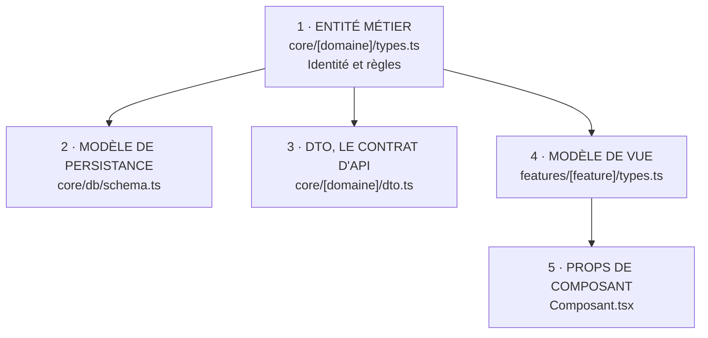
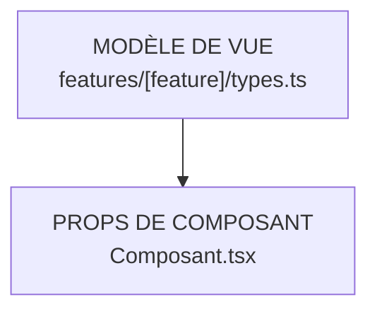

# Modélisation des Données dans Maedow Arch (Zéro Modèle dans le JSX)

> **Guide de Conception des Types et Modèles de Données sous Maedow Arch**  
> Ce document formalise la séparation absolue entre les modèles de données métier et les composants d'interface graphique (JSX/TSX), tout en appliquant le principe de pragmatisme typé de Maedow Arch.

---

## Le Principe Maedow Arch : Pourquoi Séparer les Modèles du JSX ?

Dans de nombreuses bases de code, les interfaces TypeScript sont écrites directement au-dessus des composants React (`.tsx`). **Maedow Arch** proscrit cette pratique pour 3 raisons fondamentales :

1. **Couplage Fort UI / Métier** : Un composant d'affichage devient responsable de la structure des données du domaine. Si l'UI change, le modèle risque d'être altéré.
2. **Impossibilité de Réutiliser ou Tester** : Pour tester une règle métier ou un calcul sur un modèle, il faut importer un fichier `.tsx`, ce qui charge inutilement l'environnement React/DOM.
3. **Pollution du Scope Visuel** : Le fichier `.tsx` doit se concentrer sur une seule responsabilité : **l'affichage et la gestion des événements de rendu**.

---

## La Typologie des Modèles dans Maedow Arch

<ModeFull>

Maedow Arch distingue 5 catégories de modèles claires :



</ModeFull>

<ModeLight>

En Mode Light, la couche `core/` n'existe pas : les trois premières catégories, qui y vivent, n'ont pas lieu d'être. Deux formes subsistent, et la règle « zéro modèle dans le JSX » vaut identiquement.



Les types métier d'un projet Light vivent dans `features/<feature>/types.ts`, au plus près de leur usage. Basculer vers le Mode Full consiste alors à les extraire vers `core/`, domaine par domaine, jamais en un seul refactor global.

</ModeLight>

<ModeFull>

### L'Entité Métier (`core/<domaine>/types.ts`)
Représente l'objet métier pur au sein du système.

```typescript
// core/products/types.ts
export interface Product {
  id: string;
  sku: string;
  name: string;
  priceCents: number;
  currency: "EUR" | "USD";
  status: "draft" | "published" | "archived";
  stockAvailable: number;
}
```

### Le Modèle de Persistance (`core/storage/` ou `core/database/`)
Représente la structure physique en base de données.

```typescript
// core/storage/types.ts
export interface ProductRow {
  id: string;
  sku: string;
  title: string;
  price_cents: number;
  created_at: string;
  updated_at: string;
  owner_id: string;
}
```

### Le DTO / Data Transfer Object avec Inférence Zod (`core/<domaine>/dto.ts`)
Définit la charge utile validée aux frontières (API, formulaires, webhooks) en tirant parti de `z.infer` :

```typescript
// core/products/dto.ts
import { z } from "zod";

export const CreateProductSchema = z.object({
  sku: z.string().min(3).max(20),
  name: z.string().min(1),
  priceCents: z.number().positive(),
  currency: z.enum(["EUR", "USD"]),
});

// ✅ Inférence automatique du type DTO à partir du validateur
export type CreateProductDTO = z.infer<typeof CreateProductSchema>;
```

</ModeFull>

### Le ViewModel d'Affichage (`features/<feature>/types.ts`)
Adapté aux besoins d'un écran spécifique.

```typescript
// features/products-list/types.ts
export interface ProductListItemView {
  id: string;
  title: string;
  formattedPrice: string; // Ex: "49,00 €"
  badgeTone: "success" | "warning" | "danger";
  isOutOfStock: boolean;
}
```

### Les Props de Composant (`Composant.tsx`)
Seul type autorisé directement dans un fichier `.tsx`, décrivant uniquement les paramètres d'entrée du composant.

```tsx
// features/products-list/ProductCard.tsx
import type { ProductListItemView } from "./types";

interface ProductCardProps {
  product: ProductListItemView;
  onSelect: (productId: string) => void;
  className?: string;
}

export function ProductCard({ product, onSelect, className }: ProductCardProps) {
  return (
    <div className={className} onClick={() => onSelect(product.id)}>
      <h3>{product.title}</h3>
      <span>{product.formattedPrice}</span>
    </div>
  );
}
```

---

## Règle du Pragmatisme Typé Maedow Arch (Anti Over-Engineering)

1. **Cas Simple (1:1)** : Si la vue utilise exactement les mêmes champs que l'entité du domaine, utilisez un type alias direct ou `Pick<Entity, ...>` :
   ```typescript
   // features/user-details/types.ts
   import type { User } from "@/core/users/types";

   // ✅ Pas de duplication inutile de champs
   export type UserDetailsView = Pick<User, "id" | "name" | "email">;
   ```
2. **Inférence Zod Systématique** : Ne définissez jamais une interface manuelle en double d'un schéma Zod. Utilisez `z.infer<typeof MonSchema>`.
3. **Types de Formulaires** : Dérivez les types de formulaires depuis le schéma de validation du domaine (`type FormValues = z.infer<typeof FormSchema>`).

---

## Matrice de Localisation des Fichiers Maedow Arch

| Type de Donnée / Logique | Extension | Dossier Cible | Exemple de Fichier |
| :--- | :--- | :--- | :--- |
| **Entités du Domaine** | `.ts` | `core/<domaine>/` | `core/user/types.ts` |
| **Contrats de Services / Repositories** | `.ts` | `core/<domaine>/` | `core/user/repository.contract.ts` |
| **Schémas de Validation (Zod/Valibot)** | `.ts` | `core/<domaine>/` | `core/user/validation.ts` |
| **Machines d'États & Réducteurs Purs** | `.ts` | `core/<domaine>/` | `core/cart/reducer.ts` |
| **ViewModels Spécifiques à un Écran** | `.ts` | `features/<feature>/` | `features/checkout/types.ts` |
| **Composants Métier Partagés** | `.tsx` | `features/_shared/` | `features/_shared/UserAvatar.tsx` |
| **Hooks React Métier** | `.ts` | `features/<feature>/hooks/` | `features/checkout/hooks/useCheckout.ts` |
| **Composants d'Interface (Rendu)** | `.tsx` | `features/<feature>/` | `features/checkout/CheckoutForm.tsx` |

---

## Exemple Comparatif Avant / Après

### ❌ Anti-Pattern : Modèle mélangé dans le JSX
```tsx
// features/profile/UserProfile.tsx
import React, { useState } from "react";

// ❌ Définition métier dans le composant d'UI
export interface UserAccount {
  id: string;
  email: string;
  balance: number;
}

export function UserProfile() {
  const [user, setUser] = useState<UserAccount | null>(null);
  return <div>{user?.email}</div>;
}
```

### ✅ Clean Pattern Maedow Arch : Découplage complet

1. **Modèle de Domaine (`core/user/types.ts`)** :
```typescript
export interface UserAccount {
  id: string;
  email: string;
  balanceCents: number;
}
```

2. **Hook & ViewModel (`features/profile/hooks/useUserProfile.ts`)** :
```typescript
import { useState } from "react";
import type { UserAccount } from "@/core/user/types";

export interface UserProfileView {
  email: string;
  formattedBalance: string;
  isVip: boolean;
}

export function useUserProfile(userId: string) {
  const [profile, setProfile] = useState<UserProfileView | null>(null);
  // Logique de chargement et transformation du domaine vers la vue
  return { profile, isLoading: false };
}
```

3. **Composant Visuel Pur (`features/profile/UserProfile.tsx`)** :
```tsx
import type { UserProfileView } from "./hooks/useUserProfile";

interface UserProfileProps {
  profile: UserProfileView;
}

export function UserProfile({ profile }: UserProfileProps) {
  return (
    <section>
      <h2>{profile.email}</h2>
      <p>Solde : {profile.formattedBalance}</p>
      {profile.isVip && <span className="badge">VIP</span>}
    </section>
  );
}
```
