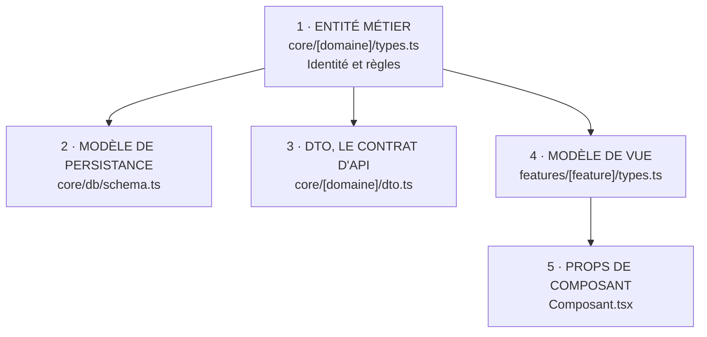
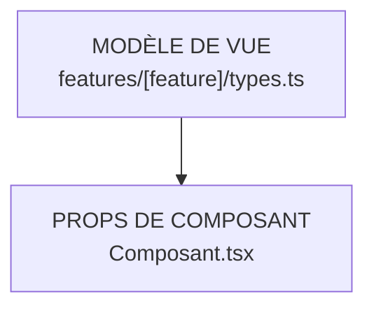

# Modélisation des Données dans Maedow Arch (Zéro Modèle dans le JSX)

> **Guide de Conception des Types et Modèles de Données sous Maedow Arch**  
> Ce document formalise la séparation absolue entre les modèles de données métier et les composants d'interface graphique (JSX/TSX), tout en appliquant le principe de pragmatisme typé de Maedow Arch.

---

## Le Principe Maedow Arch : Pourquoi Séparer les Modèles du JSX ?

Dans de nombreuses bases de code, les interfaces TypeScript sont écrites directement au-dessus des composants React (`.tsx`). **Maedow Arch** proscrit cette pratique pour 3 raisons fondamentales :

1. **Couplage Fort UI / Métier** : Un composant d'affichage devient responsable de la structure des données du domaine. Si l'UI change, le modèle risque d'être altéré.
2. **Impossibilité de Réutiliser ou Tester** : Pour tester une règle métier ou un calcul sur un modèle, il faut importer un fichier `.tsx`, ce qui charge inutilement l'environnement React/DOM.
3. **Pollution du Scope Visuel** : Le fichier `.tsx` doit se concentrer sur une seule responsabilité : **l'affichage et la gestion des événements de rendu**.

---

## La Typologie des Modèles dans Maedow Arch

<ModeFull>

Maedow Arch distingue 5 catégories de modèles claires :



</ModeFull>

<ModeLight>

En Mode Light, la couche `core/` n'existe pas : les trois premières catégories, qui y vivent, n'ont pas lieu d'être. Deux formes subsistent, et la règle « zéro modèle dans le JSX » vaut identiquement.



Les types métier d'un projet Light vivent dans `features/<feature>/types.ts`, au plus près de leur usage. Basculer vers le Mode Full consiste alors à les extraire vers `core/`, domaine par domaine, jamais en un seul refactor global.

</ModeLight>

<ModeFull>

### L'Entité Métier (`core/<domaine>/types.ts`)
Représente l'objet métier pur au sein du système.

```typescript
// core/products/types.ts
export interface Product {
  id: string;
  sku: string;
  name: string;
  priceCents: number;
  currency: "EUR" | "USD";
  status: "draft" | "published" | "archived";
  stockAvailable: number;
}
```

### Le Modèle de Persistance (`core/storage/` ou `core/database/`)

Représente la structure physique en base de données, quand elle diffère de l'entité.

**Quand elle ne diffère pas, ne la dupliquez pas.** Une table dont les colonnes reprennent les champs de l'entité au nommage près ne justifie pas un second type : c'est exactement le cas où la [Règle du Pragmatisme Typé](#règle-du-pragmatisme-typé-maedow-arch-anti-over-engineering) demande de s'abstenir. Un `ProductRow` qui n'apporte que le passage de `priceCents` à `price_cents` coûte un fichier, un mapper et deux endroits à modifier, sans rien protéger.

La séparation se justifie quand **l'entité n'a pas la forme d'une table**, ce qui arrive dès qu'un agrégat en occupe plusieurs.

```typescript
// core/orders/types.ts
// L'agrégat, tel que le domaine le manipule : un objet, avec ses lignes.
export interface Customer {
  id: string;
  name: string;
  email: string;
}

export interface OrderLine {
  sku: string;
  label: string;
  quantity: number;
  unitPriceCents: number;
}

export interface Order {
  id: string;
  placedAt: Date;
  customer: Customer;
  lines: OrderLine[];
  totalCents: number;
}
```

```typescript
// core/orders/rows.ts
// Les trois tables, telles que la base les renvoie : à plat, liées par des
// identifiants, et sans le total, qui se calcule.
export interface OrderRow {
  id: string;
  customer_id: string;
  placed_at: string;
}

export interface OrderLineRow {
  order_id: string;
  sku: string;
  label: string;
  quantity: number;
  unit_price_cents: number;
}

export interface CustomerRow {
  id: string;
  full_name: string;
  email: string;
}
```

La séparation n'a de sens que si quelque chose reconstruit l'un depuis les autres. C'est ce mapper qui porte la valeur, et non les types :

```typescript
// core/orders/mapper.ts
import type { Order, OrderLine } from "./types";
import type { CustomerRow, OrderLineRow, OrderRow } from "./rows";

function toLine(row: OrderLineRow): OrderLine {
  return {
    sku: row.sku,
    label: row.label,
    quantity: row.quantity,
    unitPriceCents: row.unit_price_cents,
  };
}

export function toOrder(row: OrderRow, customer: CustomerRow, lineRows: OrderLineRow[]): Order {
  const lines = lineRows.filter((line) => line.order_id === row.id).map(toLine);

  return {
    id: row.id,
    placedAt: new Date(row.placed_at),
    customer: { id: customer.id, name: customer.full_name, email: customer.email },
    lines,
    totalCents: lines.reduce((total, line) => total + line.quantity * line.unitPriceCents, 0),
  };
}
```

Trois choses se voient ici, et aucune ne se verrait sur un exemple 1:1.

**Le domaine ignore le nombre de tables.** Un service qui reçoit un `Order` ne sait pas s'il vient d'une jointure, de trois requêtes ou d'un cache. Changer ce point ne touche que le mapper.

**Le total n'existe pas en base, il se calcule.** Une entité peut porter des champs dérivés que la persistance ne stocke pas, et c'est précisément ce qu'un type de ligne ne saurait pas exprimer.

**Le mapper est une fonction pure, donc testable sans base de données.** C'est là que se logent les erreurs de reconstruction, et c'est la seule partie qu'il vaut la peine de tester dans cette couche.

### Le DTO / Data Transfer Object avec Inférence Zod (`core/<domaine>/dto.ts`)
Définit la charge utile validée aux frontières (API, formulaires, webhooks) en tirant parti de `z.infer` :

```typescript
// core/products/dto.ts
import { z } from "zod";

export const CreateProductSchema = z.object({
  sku: z.string().min(3).max(20),
  name: z.string().min(1),
  priceCents: z.number().positive(),
  currency: z.enum(["EUR", "USD"]),
});

// ✅ Inférence automatique du type DTO à partir du validateur
export type CreateProductDTO = z.infer<typeof CreateProductSchema>;
```

### Le DTO de Sortie (`core/<domaine>/dto.ts`)

Le DTO d'entrée décrit ce que le client a le droit d'**envoyer**. Le DTO de sortie décrit ce qu'il a le droit de **recevoir**, et il manque presque toujours.

La fuite la plus courante n'est pas un secret dans un journal, c'est une entité rendue telle quelle :

```typescript
// ❌ Ce qui part vers le client dépend de la forme de l'entité
export async function getUser(id: string) {
  const user = await repository.findById(id);
  return user; // passwordHash et internalNotes partent avec
}
```

Rien n'échoue. Le type de retour est correct, les tests passent, et le champ qu'on vient d'ajouter à l'entité pour un besoin interne se retrouve dans la réponse HTTP le jour même. C'est ce qui rend le défaut durable : il ne se manifeste jamais du côté où on le cherche.

Le remède est le symétrique exact du DTO d'entrée. Un schéma décrit la sortie, et la fonction de sérialisation passe par lui :

```typescript
// core/users/types.ts
export interface User {
  id: string;
  name: string;
  email: string;
  passwordHash: string;
  internalNotes: string;
  role: "member" | "admin";
}
```

```typescript
// core/users/dto.ts
import { z } from "zod";
import type { User } from "./types";

// Entrée : ce que le client a le droit d'envoyer.
export const CreateUserSchema = z.object({
  name: z.string().min(1),
  email: z.email(),
});

export type CreateUserDTO = z.infer<typeof CreateUserSchema>;

// Sortie : ce que le client a le droit de recevoir. Décrit, jamais déduit.
export const PublicUserSchema = z.object({
  id: z.string(),
  name: z.string(),
  email: z.email(),
  role: z.enum(["member", "admin"]),
});

export type PublicUserDTO = z.infer<typeof PublicUserSchema>;

export function toPublicUser(user: User): PublicUserDTO {
  return PublicUserSchema.parse(user);
}
```

**La règle : ce qui sort vers le client est décrit, jamais laissé au hasard de la forme de l'entité.**

Trois conséquences valent d'être dites.

**Le schéma ne fait pas que valider, il filtre.** `parse` ne conserve que les clés qu'il décrit : `passwordHash` et `internalNotes` ne traversent pas, même si l'appelant les a oubliés dans l'objet transmis.

**Un champ ajouté à l'entité ne sort pas tout seul.** C'est l'inverse d'un `Omit<User, "passwordHash">`, qui laisse passer par défaut et n'exclut que ce dont on s'est souvenu. Une liste d'exclusions est en retard d'un champ en permanence ; une liste d'inclusions ne l'est jamais.

**Le retrait d'un champ de la sortie devient visible.** Il se lit dans le schéma, à un seul endroit, au lieu de se déduire de ce que chaque route renvoie.

</ModeFull>

### Le ViewModel d'Affichage (`features/<feature>/types.ts`)
Adapté aux besoins d'un écran spécifique.

```typescript
// features/products-list/types.ts
export interface ProductListItemView {
  id: string;
  title: string;
  formattedPrice: string; // Ex: "49,00 €"
  badgeTone: "success" | "warning" | "danger";
  isOutOfStock: boolean;
}
```

### Les Props de Composant (`Composant.tsx`)
Seul type autorisé directement dans un fichier `.tsx`, décrivant uniquement les paramètres d'entrée du composant.

```tsx
// features/products-list/ProductCard.tsx
import type { ProductListItemView } from "./types";

interface ProductCardProps {
  product: ProductListItemView;
  onSelect: (productId: string) => void;
  className?: string;
}

export function ProductCard({ product, onSelect, className }: ProductCardProps) {
  return (
    <div className={className} onClick={() => onSelect(product.id)}>
      <h3>{product.title}</h3>
      <span>{product.formattedPrice}</span>
    </div>
  );
}
```

---

## Règle du Pragmatisme Typé Maedow Arch (Anti Over-Engineering)

1. **Cas Simple (1:1)** : Si la vue utilise exactement les mêmes champs que l'entité du domaine, utilisez un type alias direct ou `Pick<Entity, ...>` :
   ```typescript
   // features/user-details/types.ts
   import type { User } from "@/core/users/types";

   // ✅ Pas de duplication inutile de champs
   export type UserDetailsView = Pick<User, "id" | "name" | "email">;
   ```
2. **Inférence Zod Systématique** : Ne définissez jamais une interface manuelle en double d'un schéma Zod. Utilisez `z.infer<typeof MonSchema>`.
3. **Types de Formulaires** : Dérivez les types de formulaires depuis le schéma de validation du domaine (`type FormValues = z.infer<typeof FormSchema>`).

---

## Matrice de Localisation des Fichiers Maedow Arch

| Type de Donnée / Logique | Extension | Dossier Cible | Exemple de Fichier |
| :--- | :--- | :--- | :--- |
| **Entités du Domaine** | `.ts` | `core/<domaine>/` | `core/user/types.ts` |
| **Contrats de Services / Repositories** | `.ts` | `core/<domaine>/` | `core/user/repository.contract.ts` |
| **Schémas de Validation (Zod/Valibot)** | `.ts` | `core/<domaine>/` | `core/user/validation.ts` |
| **Machines d'États & Réducteurs Purs** | `.ts` | `core/<domaine>/` | `core/cart/reducer.ts` |
| **ViewModels Spécifiques à un Écran** | `.ts` | `features/<feature>/` | `features/checkout/types.ts` |
| **Composants Métier Partagés** | `.tsx` | `features/_shared/` | `features/_shared/UserAvatar.tsx` |
| **Hooks React Métier** | `.ts` | `features/<feature>/hooks/` | `features/checkout/hooks/useCheckout.ts` |
| **Composants d'Interface (Rendu)** | `.tsx` | `features/<feature>/` | `features/checkout/CheckoutForm.tsx` |

---

## Exemple Comparatif Avant / Après

### ❌ Anti-Pattern : Modèle mélangé dans le JSX
```tsx
// features/profile/UserProfile.tsx
import React, { useState } from "react";

// ❌ Définition métier dans le composant d'UI
export interface UserAccount {
  id: string;
  email: string;
  balance: number;
}

export function UserProfile() {
  const [user, setUser] = useState<UserAccount | null>(null);
  return <div>{user?.email}</div>;
}
```

### ✅ Clean Pattern Maedow Arch : Découplage complet

1. **Modèle de Domaine (`core/user/types.ts`)** :
```typescript
export interface UserAccount {
  id: string;
  email: string;
  balanceCents: number;
}
```

2. **Hook & ViewModel (`features/profile/hooks/useUserProfile.ts`)** :
```typescript
import { useState } from "react";
import type { UserAccount } from "@/core/user/types";

export interface UserProfileView {
  email: string;
  formattedBalance: string;
  isVip: boolean;
}

export function useUserProfile(userId: string) {
  const [profile, setProfile] = useState<UserProfileView | null>(null);
  // Logique de chargement et transformation du domaine vers la vue
  return { profile, isLoading: false };
}
```

3. **Composant Visuel Pur (`features/profile/UserProfile.tsx`)** :
```tsx
import type { UserProfileView } from "./hooks/useUserProfile";

interface UserProfileProps {
  profile: UserProfileView;
}

export function UserProfile({ profile }: UserProfileProps) {
  return (
    <section>
      <h2>{profile.email}</h2>
      <p>Solde : {profile.formattedBalance}</p>
      {profile.isVip && <span className="badge">VIP</span>}
    </section>
  );
}
```
